# 🧩 ConribuArt

Generate an animated SVG of your GitHub contribution graph with falling [Tetris](https://en.wikipedia.org/wiki/Tetris) pieces and an optional logo overlay — all as a GitHub Action.

<p align="center">
  
</p>

## Usage

### Minimal

```yaml
- uses: leereilly/contribuart@v1
  with:
    github_user_name: ${{ github.repository_owner }}
```

### Full Configuration

```yaml
- uses: leereilly/contribuart@v1
  with:
    github_user_name: ${{ github.repository_owner }}
    github_token: ${{ secrets.GITHUB_TOKEN }}
    output_path: dist/contribution-graph.svg
    tetromino_count: "5"
    logo: "microsoft"
    logo_position: "top-right"
    palette: "auto"
    animation_duration: "8"
```

### Complete Workflow Example

Create `.github/workflows/contribuart.yml` in your profile repo (`username/username`):

```yaml
name: Generate Contribution Art

on:
  schedule:
    - cron: "0 0 * * *" # daily
  workflow_dispatch:
  push:
    branches: [main]

jobs:
  generate:
    runs-on: ubuntu-latest
    permissions:
      contents: write
    steps:
      - uses: actions/checkout@v4

      - name: Generate contribution graph SVG
        uses: leereilly/contribuart@v1
        with:
          github_user_name: ${{ github.repository_owner }}
          tetromino_count: "3"
          logo: "microsoft"

      - name: Push to output branch
        uses: crazy-max/ghaction-github-pages@v3.1.0
        with:
          target_branch: output
          build_dir: dist
        env:
          GITHUB_TOKEN: ${{ secrets.GITHUB_TOKEN }}
```

Then add this to your profile `README.md`:

```html
<picture>
  <source media="(prefers-color-scheme: dark)" srcset="https://raw.githubusercontent.com/USERNAME/USERNAME/output/contribution-graph.svg">
  <source media="(prefers-color-scheme: light)" srcset="https://raw.githubusercontent.com/USERNAME/USERNAME/output/contribution-graph.svg">
  
</picture>
```

Replace `USERNAME` with your GitHub username.

## Inputs

| Input | Required | Default | Description |
|-------|----------|---------|-------------|
| `github_user_name` | **Yes** | — | GitHub username to fetch contribution data for |
| `github_token` | No | `${{ github.token }}` | GitHub token for API access |
| `output_path` | No | `dist/contribution-graph.svg` | Output file path for the generated SVG |
| `tetromino_count` | No | `3` | Number of falling tetrominoes (0–9) |
| `logo` | No | `none` | Logo to overlay on the grid (e.g. `microsoft`, `none`) |
| `logo_position` | No | `top-right` | Logo position (`top-right`, `top-left`, `bottom-right`, `bottom-left`) |
| `palette` | No | `auto` | Color palette (`github-light`, `github-dark`, `auto`) |
| `animation_duration` | No | `6.5` | Total animation duration in seconds |

## Outputs

| Output | Description |
|--------|-------------|
| `svg_path` | Path to the generated SVG file |

## How It Works

1. **Fetches** your contribution data from the GitHub GraphQL API
2. **Builds** a 53×7 grid matching GitHub's contribution graph layout
3. **Places** randomly selected tetromino pieces (I, O, T, S, Z, L, J) across the grid
4. **Animates** each piece falling top-to-bottom using SVG `<animate>` elements with discrete keyframes
5. **Overlays** an optional logo (e.g. Microsoft) in a corner of the grid
6. **Outputs** a single animated SVG file

The `auto` palette uses CSS `@media (prefers-color-scheme)` so the graph adapts to the viewer's light/dark mode setting.

## Development

```bash
# Install dependencies
npm install

# Run tests
npm test

# Build the action bundle
npm run build
```

## License

MIT
